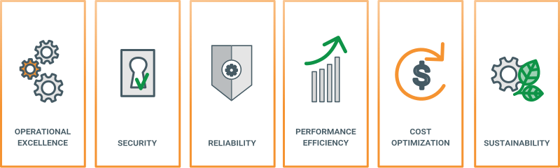

# 2. Account and Organization Management

## Content

- AWS Support
- Advanced concepts
- Well-Architected Framework
- Best Practises
- The following services will be explained and focued on:
    - Billing and Cost Management
    - Config
    - Control Tower
    - Marketplace
    - Organization
    - Service Quotas
    - Trusted Advisor
    - Well-Architected Tool

## Well-Architected Framework

The **AWS Well-Architected Framework** provides a set of principles and best practices for building secure, high-performing, resilient, and efficient cloud workloads. It's based on **six pillars** that guide architecture decisions. Following we will explain the pillars with examples of architecture decisions regarding those pillars:



### The Six Pillars of the AWS Well-Architected Framework

1. #### **Operational Excellence**
   Focuses on operations in the cloud: monitoring, incident response, automation, and evolution of procedures over time.

   ✅ **Examples:**
   - Using **CloudWatch Alarms**, the monitoring solution from AWS, to detect failure conditions
   - Creating **runbooks** for common issues
   - Automating recovery with **eventbased** computation

2. #### **Security**
   Protects data, systems, and assets through risk assessments and mitigation strategies. Includes identity & access management, encryption, and incident detection.

   ✅ **Examples:**
   - Enforcing least privilege access
   - Encrypting data at rest using **KMS**, the key management solution from AWS
   - Using security services like **GuardDuty** or **Security Hub** for threat detection

3. #### **Reliability**
   Ensures a workload performs its intended function correctly and consistently. Focuses on fault tolerance, recovery strategies, and distributed systems design.

   ✅ **Examples:**
   - Deploying workloads across multiple **Availability Zones**
   - Using **Auto Scaling Groups** for VM's or PaaS/SaaS services with auto-scaling
   - Backing up with **AWS Backup** and restoring via snapshots

4. #### **Performance Efficiency**
   Efficiently uses computing resources to meet system requirements and adapt to changes in demand.

   ✅ **Examples:**
   - Using **Graviton-based instances for vm's/servers** where suitable
   - Leveraging **Intelligent-Tiering** to reduce cost based on usage patterns on the filestorage **S3**
   - Migrating to **managed services** like **Aurora** or **Lambda** (we will explain those later)

5. #### **Cost Optimization**
   Avoids unnecessary costs. Encourages tracking, controlling, and optimizing spend across resources and services.

   ✅ **Examples:**
   - Rightsizing instances with **Cost Explorer** and **Compute Optimizer**
   - Deleting unused resources
   - Architecting to an event-based system and switch services to cost-efficent on-demand 0 scale solutions like **Lambda**

6. #### **Sustainability**
   Focuses on minimizing environmental impacts of running cloud workloads. Newest addition to the framework.

   ✅ **Examples:**
   - Migrating to **serverless** (ideally 0 scale) to reduce always-on infrastructure
   - Using **managed services** (e.g., DynamoDB over self-hosted DBs)
   - Reducing overprovisioning to save both cost and energy

### Well-Architected Tool

The **Well-Architected Tool** in the AWS Console helps you apply the six-pillar framework to real workloads. It provides:

- A structured **questionnaire**
- A visual **risk report**
- An **improvement plan** with AWS best-practice recommendations

#### When to Use the Well-Architected Tool

✅ **Use it when**:
- You’re **new to AWS** and want a guided way to review a solution.
- You want a **baseline assessment** of a new workload.
- You’re in the **planning or post-deployment** phase of a project.
- You want to **track risk** and **improvement opportunities** across multiple workloads.
- You are preparing for a **Well-Architected Review** with AWS or a partner.

❌ **Do not use it as**:
- A **replacement for expert consultation** — it doesn't replace architecture experience or a full design review.
- The **ultimate source of truth** — answers are based on your interpretation, and not all edge cases or architectures are perfectly covered.
- A one-time checklist — it’s meant to be **iterative**, not one-and-done.

### Best Practices

✅ Use real workloads when possible for meaningful results  
✅ Reassess workloads periodically (e.g., every 3–6 months)  
✅ Document why specific answers were chosen  
✅ Use the tool collaboratively (DevOps, security, infra teams)  
✅ Act on high-risk issues first  
❌ It takes a long time to work through the workload definition - so don't use it with only a few minutes of time     
❌ Don’t treat results as exhaustive or prescriptive  

### Optional Extension

If you have access to your own AWS workload, try running a real Well-Architected Review on it and compare how it differs from the example.

## AWS Support

AWS provides multiple levels of support to help customers plan, deploy, and manage their workloads effectively.

### Tiers

AWS offers four **Support Plans**, each designed for different use cases and levels of criticality:

1. **Basic (Free)**  
   - Access to the AWS documentation, whitepapers, service health dashboard, and forums  
   - No access to AWS Support engineers
   - Able to record bugs or ask for service quotas, reopen closed account and so on
   - Will be enough for most cases
   - 💸 Free

2. **Developer**  
   - Everything from previous tiers
   - One primary contact
   - Email access to Cloud Support **Associates** during business hours  
   - Guidance on best practices
   - Response time:
        - General guidance: < 24 hours
        - System impaired: < 12 hours
   - 💸 $29/month

3. **Business**  
   - Everything from previous tiers
   - Umlimited contacts
   - 24/7 access to AWS Support **Engineers** via phone, chat, and email  
   - IAM Support included
   - additional premium service capabilities
   - Response time:
        - General guidance: < 24 hours
        - System impaired: < 12 hours
        - Production system impaired: < 4 hours
        - Production system down: < 1 hour
   - 💸 $100/month

4. **Enterprise**  
   - Everything from previous tiers
   - For mission-critical workloads
   - 24/7 access to **senior** Cloud Support Engineers  
   - Access to a Technical Account Manager (TAM) 
   - Concierge support team and full additional premium service capabilities
   - Response time:
        - General guidance: < 24 hours
        - System impaired: < 12 hours
        - Production system impaired: < 4 hours
        - Production system down: < 1 hour
        - Business-critical system down: < 15 minutes
   - 💸 $15'000/month

For a full comparison, see:  
→ Console → **Support Center** → **Compare Plans**

#### Services depending on Support
Several AWS services are only available — or offer enhanced features — depending on your selected **Support Plan**. Understanding this helps you determine which support level your organization actually needs.

**✅ Trusted Advisor**

**AWS Trusted Advisor** is a tool that provides real-time guidance on how to optimize your AWS environment across five categories:

- **Cost Optimization**
- **Security**
- **Fault Tolerance**
- **Performance**
- **Service Limits**

**Access Based on Support Plan:**

| Support Plan     | Trusted Advisor Access     |
|------------------|----------------------------|
| Basic & Developer | Limited (Core Checks only) |
| Business & Enterprise | Full access to all checks, automated reports, refresh, and alerting |

> 🔎 *Example: Only Business/Enterprise plans get cost-savings checks for unused EBS (service for vm/server disks) volumes or underutilized EC2 (service for vm/servers) instances.*

---

**🚨 Trusted Advisor Priority**

**Trusted Advisor Priority** is an enhanced version of Trusted Advisor available only for **Enterprise Support** customers.

It provides:
- Prioritized, **proactive recommendations** based on your specific workloads
- Direct input from AWS account teams and support engineers
- Integration with AWS Health events and operational risk signals

---

**📈 AWS Health Dashboard and Health API**

The **AWS Health Dashboard** displays real-time and historical events from AWS services (that you cannot directly influence like a service outage) that impact your AWS account:

- Outages
- Service degradation
- Region-specific issues
- Scheduled maintenance

**Access Based on Support Plan:**

- All plans get access to the **basic Health Dashboard**
- Business & Enterprise plans gain:
  - **Personalized events** for your account/services
  - **AWS Health API** access for automation or dashboards

> 🔎 *Use the Health API to notify internal teams or trigger scripts when a regional event affects critical workloads.*

---

**⏱️ AWS Countdown**

**AWS Countdown** is a structured planning and coordination service for **major launch events**, like:

- Product releases
- Black Friday / Cyber Monday readiness
- Large migration or cutover windows

✅ **Only available with Enterprise Support**

Provides:
- Early-stage architecture reviews
- Operational readiness checks
- Real-time support during the event window

> 🧠 *Think of it like a mission control team from AWS helping you prepare and stabilize.*

---

**🛠️ AWS Managed Services (AMS)**

**AMS** is a service that operates your AWS infrastructure **on your behalf**, under strict operational and compliance standards.

- Available as a paid managed service
- Often used by enterprises needing 24/7 management, patching, backup, and security enforcement
- Available only for **Business Support** & **Enterprise Support**

---

**Summary**

| Service                  | Basic | Developer | Business | Enterprise |
|--------------------------|-------|-----------|----------|------------|
| Trusted Advisor (Core)   | ✅    | ✅        | ✅        | ✅          |
| Trusted Advisor (Full)   | ❌    | ❌        | ✅        | ✅          |
| Trusted Advisor Priority | ❌    | ❌        | ❌        | ✅          |
| Health Dashboard (Basic) | ✅    | ✅        | ✅        | ✅          |
| Health Dashboard (Full/API) | ❌ | ❌        | ✅        | ✅          |
| AWS Countdown            | ❌    | ❌        | ❌        | ✅          |
| AWS Managed Services     | ❌    | ❌        | ✅* (Add-on)        | ✅* (Add-on) |

---

#### Best Practices

✅ Every account has his own support plan, so plan you organization accordingly to avoid paying the same service fee multiple times  
✅ Choose the **support plan** aligned with your **operational needs**, not just your budget  
✅ In most cases the basic plan suffice. Developer is rarely bought based on our experience and business is very dependent on the case and special needs  
✅ Review **Trusted Advisor** regularly to reduce risk and cost  
✅ Use the **Health API** for internal observability and response automation  
✅ For mission-critical workloads, **Enterprise Support** is not optional — it's strategic but extremly costly

### Knowledge Center

The **AWS Knowledge Center** is a public resource that provides FAQs, troubleshooting guides, and configuration tips for common AWS issues.

🔎 Visit: https://aws.amazon.com/premiumsupport/knowledge-center/

Typical use cases:
- Resolving common IAM permission errors
- Fixing EC2 launch issues
- Understanding S3 storage classes

### Service Quotas

AWS sets default **quotas (limits)** on many services — for example, the number of EC2 instances per region, Lambda execution concurrency, or SMS sending rates via SNS. There exists a quota for almost every service AWS provides.

These quotas can usually be **increased on request**.

#### Hands-On Lab – Requesting More SMS Quota for Amazon SNS

> In this lab, you’ll walk through how to request a **quota increase** for **SMS messages per day** in **Amazon SNS**. This is a common task for organizations sending notifications or alerts via text.

⚠️ **Note:** You’ll stop before submitting the actual request. We don't want to create unnecessary support tickets!

1. **Open the AWS Console.**
2. Navigate to the Service Quotas
3. Search out the right service.
    <details>
    <summary>If you having issues finding the proper service:</summary>

    ✅ It is SNS

    </details>

4. Make it that double the SMS can be sent based on the original quota and the new limit you request

5. 🛑 **Stop here!**  
   - Do **not** submit the request.
   - Take a screenshot or make a note of the form.
   - Discuss or reflect: _Why might you need to increase this? What are the approval implications?_


✅ AWS may contact you for clarification  
❌ Submitting unnecessary quota increase requests can delay real approvals

#### Best Practices

- Regularly monitor service usage via **CloudWatch** and **Trusted Advisor**
- Preemptively request quota increases before launching high-usage workloads
- Tag and document all quota changes in internal wikis or runbooks

## Concepts

In this section, we’ll cover essential AWS concepts that help manage resources, control cost, and leverage third-party tools.

### Tagging

**Tags** are key-value pairs attached to AWS resources. They help you **organize**, **track**, and **automate** workloads.

#### Common Use Cases

- **Cost Allocation:** Group resources by `Environment`, `Department`, or `Project`
- **Automation:** Trigger scripts or workflows based on tags
- **Governance:** Enforce compliance by tagging requirements (e.g., `Owner`, `Purpose`)
- **Searchability:** Find resources quickly via the Console or CLI
- **Billing:** Group cost exploration based on tags or create bills based on tags
- **and much more ...**

#### Example Tags

| Key         | Value            |
|-------------|------------------|
| Environment | production       |
| Owner       | alice@example.com |
| CostCenter  | HR123            |
| Project     | Internal-Portal  |

#### Best Practices

✅ Use **consistent naming conventions**  
✅ Standardize required tags via **Tag Policies (via AWS Organizations)**  
✅ Don’t tag sensitive data (e.g., passwords, tokens)  
✅ Automate tagging in Infrastructure-As-Code (e.g., via Terraform or CloudFormation)

### Free-Tier on Services

The **AWS Free Tier** helps you explore services at no cost — but it’s **not unlimited**.

#### Free Tier Categories

1. **Always Free**
   - Examples: 1M requests/month with Lambda, 1GB outbound data via CloudFront

2. **12 Months Free**
   - Examples: 750 hours/month of t2.micro or t3.micro on EC2, 5GB S3 storage

3. **Trials**
   - Temporary usage of services like AWS Macie or SageMaker Studio Lab

#### Best Practices

✅ Monitor your usage via the **Billing Dashboard**  
✅ Use **Budgets** and **Alerts** to avoid surprises  
✅ Understand **region-specific limits** (not all services are free in all regions)  
❌ Don’t assume “Free Tier” = zero cost — overages apply easily

🔗 Check: https://aws.amazon.com/free/


### Marketplace

**AWS Marketplace** is a curated catalog of third-party software, AMIs, SaaS tools, and containers that can be directly deployed into your AWS environment.

#### What You Can Find:

AWS Marketplace provides a solution to share third-party solutions, not managed by AWS, to customers. Examples are:

- Software that runs on AWS
- Operating systems (e.g., Ubuntu, Windows Server)
- Firewalls, security scanners
- Monitoring tools (e.g., Datadog, New Relic)
- Databases and caching engines
- Machine learning or analytics platforms

> 🧠 Think of it like the App Store for the cloud

#### Billing & Access in Marketplace

- Most listings offer **hourly or annual pricing**
- Charges are added to your regular **AWS bill**
- IAM policies can be used to control access

#### Hands-On Lab – Exploring AWS Marketplace

In this exercise, you'll explore AWS Marketplace, filter for free solutions, and walk through the launch steps for a product — without actually deploying it.


1. Log into the AWS Console
2. Navigate to:
   → **Services** → **AWS Marketplace**
3. On the homepage, click on **Discover Products**
4. In the left-hand filter panel:
   - Under **Pricing Model**, select `Free`
   - Under **Delivery Methods**, select `Amazon Machine Image (AMI)` 
5. Choose a product, e.g., `Bitnami WordPress`, `FreeBSD`, or `OpenVPN Access Server`.
6. Click on the product to open its detail page.
7. Review:
   - Overview
   - Pricing
   - Usage instructions
   - **End user license agreement**

🛑 **Do not confirm or launch the product** — stop before finalizing subscription.

### Best Practices

✅ Use **tagging and cost allocation** to track Marketplace usage  
✅ Restrict purchases with **IAM policies or SCPs**  
✅ Regularly audit active Marketplace subscriptions  
✅ Prefer **free trials** or **bring-your-own-license (BYOL)** where applicable  

## Billing and Cost Management

Cost transparency and optimization are critical in AWS. This section introduces the tools AWS provides to help you analyze, forecast, and control your spending.

### Savings Plans
**Savings Plans** offer flexible pricing models that provide significant cost savings over On-Demand pricing in exchange for a **commitment to a consistent usage level** over a 1- or 3-year term.

#### Types of Savings Plans

1. **Compute Savings Plans**
   - Apply across any region, instance family, OS, and tenancy.
   - Works for EC2, Fargate, Lambda.

2. **EC2 Instance Savings Plans**
   - Locked to a specific instance family in a region (e.g., `m5` in `us-east-1`).
   - Higher discount rate than Compute plans.

> 💡 You don't reserve capacity — just pricing. It's not the same as EC2 Reserved Instances.

### Cost Explorer
**Cost Explorer** is an interactive tool for analyzing your AWS spending and usage.

#### What You Can Do:

- View historical cost and usage data (up to 12 months)
- Forecast future spend based on trends
- Break down costs by service, linked account, tag, region, etc.
- Identify underused resources

> 🔍 Use filters and groupings to drill into unexpected costs quickly.

#### Hands-On Lab – Using Cost Explorer

> This lab will help you explore and analyze your AWS usage and costs with Cost Explorer.

### Step-by-Step Instructions

1. In the AWS Console, search for `Cost Explorer` and open it.
2. Click **Launch Cost Explorer** if this is your first time using it.
3. Use filters to explore:
   - Time range (last 3 months)
   - Group by `Service`
   - Add filter: `Linked account` or `Region` (if applicable)
4. Toggle on **Forecast** to see predicted spend.
5. Try changing the view:
   - Group by `Usage Type` or `Tag` (e.g., `Environment`)
6. Click **Download CSV** if you want a local report.

🛑 This is a read-only exploration — no changes are made to your account.

### Cost Optimization Hub

**Cost Optimization Hub** (newer feature) helps identify cost-saving opportunities across AWS services in one dashboard.

#### Key Features:

- Central location for cost-saving insights
- Tracks unused or underutilized resources
- Integrates with **Savings Plans** and **Reserved Instances**
- Includes **actionable recommendations**

> 🧠 Use this regularly to catch forgotten EBS volumes, idle EC2, or old snapshots.

### Budgets

**AWS Budgets** allow you to define thresholds for cost, usage, and even **Savings Plan coverage**. You’ll get alerted when your usage crosses the defined limits.

#### Budget Types

1. **Cost Budgets**
   - Set a monthly budget for total AWS spend.

2. **Usage Budgets**
   - Track usage metrics (e.g., EC2 hours, Lambda requests).

3. **Reservation Budgets**
   - Monitor Reserved Instance or Savings Plan utilization.

4. **Linked Account Budgets**
   - Track cost per child account (great for organizations using consolidated billing).

#### Hands-On Lab – Creating a Budget

> You’ll create a monthly budget that notifies you if projected spend exceeds a defined threshold.

1. **If you know Terraform, then do the following tasks with the proper Terraform resources instead of the management console!**
2. In the AWS Console, search for `Budgets` and go to **AWS Budgets**.
3. Click **Create budget** → Choose **Customize** and then **Cost budget**
4. Configure:
   - **Name:** `Training-Budget`
   - **Period:** Monthly
   - **Budget Type:** Recurring
   - **Start Month:** This month
   - **Budgeted Amount:** `$10` (or another value you want to have active on your account)
5. **Notifications**:
   - Add an alert at 80% of your budget
   - Enter your email (or a test one if this is a sandbox)
6. Click **Create budget**

🛑 If you’re in a shared or demo account, do **not** enter a team-wide alert or SNS topic.

### Best Practices

✅ Set **budgets per project, team, or environment**  
✅ Combine with **tags** to filter cost by purpose  
✅ Enable **forecast-based alerts** (not just actual spend)  
✅ Review budgets monthly — especially after scaling or launch changes  
❌ Don’t rely solely on alerts — review Cost Explorer and Trusted Advisor proactively

## Organization and Account

In this section, you will learn how AWS helps manage multiple accounts using **Organizations**, how **Control Tower** helps automate secure landing zones, and how **AWS Config** enables compliance visibility across accounts.

### AWS Organizations

**AWS Organizations** is a service for managing and governing multiple AWS accounts centrally.

#### Key Features

- Create **Organizational Units (OUs)** to group accounts by environment or purpose
- Apply **Service Control Policies (SCPs)** to enforce permissions (will be covered in a later chapter)
- Use **Consolidated Billing** to manage costs across accounts
- Automate account creation via **Account Factory** or SDK

✅ Useful for enterprises that need to separate dev/staging/prod, delegate administration, or isolate billing.

### AWS Control Tower

**Control Tower** builds on top of AWS Organizations to help you **automate the creation of a secure, governed multi-account AWS environment**.

When you set up a **Landing Zone**, AWS Control Tower performs the following actions in your **management account**:

#### Automated Setup (Control Tower Actions)

- Creates two OUs under the org root:
  - `Security`
  - `Sandbox` *(optional)*

- Creates or adds two **shared accounts** under the **Security OU**:
  - **Log Archive** account: It is dedicated to collecting all logs centrally, including logs for all of your shared and member accounts. Log files are stored in an Amazon S3 bucket. These log files allow administrators and auditors to review actions and events that have occurred.
  - **Audit** account: It is a restricted account that's designed to give your security and compliance teams read and write access to all accounts in your landing zone. From the audit account, you have programmatic access to review accounts, by means of a role that is granted to Lambda functions only. The audit account does not allow you to log in to other accounts manually.

- Sets up **IAM Identity Center** (formerly AWS SSO):
  - Creates a **cloud-native directory** with preconfigured groups and SSO access
  - You can also connect your own identity provider (IdP)
  - Will be covered and tested in a later chapter

- Applies controls:
  - **Preventive controls** (guardrails to prevent misconfiguration)
  - **Detective controls** (monitoring configuration compliance)
  - **Preventive controls are not applied to the management account**
  - All controls apply to **member accounts** under OUs

✅ AWS Control Tower gives you a quick, opinionated way to set up a secure, governed AWS Organization structure out of the box.   
✅ It's a good starting point for people starting with the topic landing zone   
✅ It's a solution managed by the provider and therefore maintained   
❌ Limited Customization for a topic that doesn't have a "one-size shoe fit them all" mentality   
❌ You can manage control tower but not it's resources via IaC   
❌ It may use services, you would rather not use and enforces you to certain ways of work   

> For those reasons we personally don't believe in Control Tower but recommend everyone starting with AWS to test it out and get an understanding of what a Landing Zone is.

#### Hands-On Lab – Organizations

> In this lab, you'll explore AWS Organization and built up a small landing zone

1. **If you know Terraform, then do the following tasks with the proper Terraform resources instead of the management console!**
2. Open the AWS Console → **Organizations**
3. Create two OUs:
   - `sandbox`
   - `management`
4. Under `management`, create **three accounts**:
   - `security`
   - `configuration`
   - `network`
5. Under `sandbox` create one account `test`
6. Confirm the structure:
   ```
   / (root)
   ├── management
   │ ├── security
   │ ├── configuration
   │ └── network
   └── sandbox
     └── test
   ```
7. Allow now the following services in the org (in terraform it's the service principal field) for later org-wide service-usage:
   - Identity Center (terraform: `"sso.amazonaws.com"`)
   - Cloudtrail (terraform: `"cloudtrail.amazonaws.com"`)
   - Resource Access Manager (terraform: `"ram.amazonaws.com"`)
8. Allow resource control policy types for your organization (will be used later)
📝 You’ll use this manually created structure in **later exercises**, such as Config or SCPs.

### AWS Config

**AWS Config** records and evaluates resource configurations over time. It’s essential for:

- **Auditing** AWS resource history
- **Detecting misconfigurations**
- **Verifying compliance** with policies or standards
- Integrating with **AWS Security Hub**, **Control Tower**, and **Lambda Remediation**

#### Key Concepts

- **Configuration Recorder**: Captures configuration changes
- **Delivery Channel**: Pushes data to an S3 bucket (Filestorage solution)
- **Aggregators**: Pull configuration data across accounts/regions
- **Rules**: Validate compliance (e.g., "S3 buckets must have versioning enabled")

### Best Practices

✅ Use Control Tower for fast, governed multi-account onboarding  
✅ Use Organizations when you want custom, manual control  
✅ Enable AWS Config early in every account  
✅ Aggregate Config data to a central account  
✅ Tag your accounts and OUs for traceability  
❌ Don’t disable Config — even "quiet" accounts should be monitored

## Bespinians most used Ranking

✅ **Organization** (plain without Control Tower) for landing zones   
✅ **Config** for cross account configuration tracking   
✅ **Service Quotas** for everytime we hit a Soft-Quota limit (for example sms limit)   
✅ **Trusted Advisor** for very insecure customers that needed support beyond our mandates   
✅ **Cost Explorer** for checking cost exploitation   
✅ **Budet** for Budget control on member sandboxes (no bad surprises when someone forgets to shut of EC2-Instance)